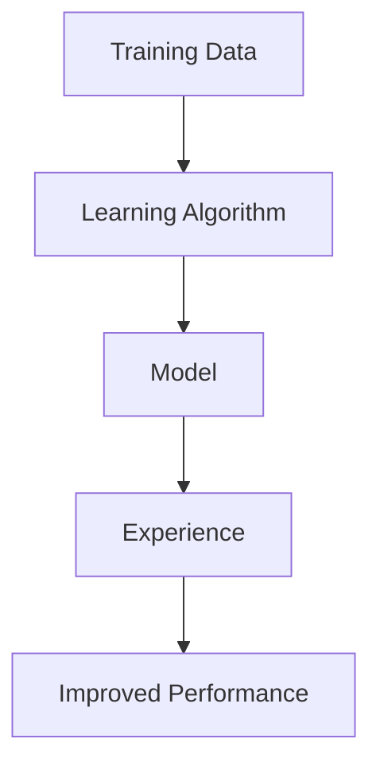
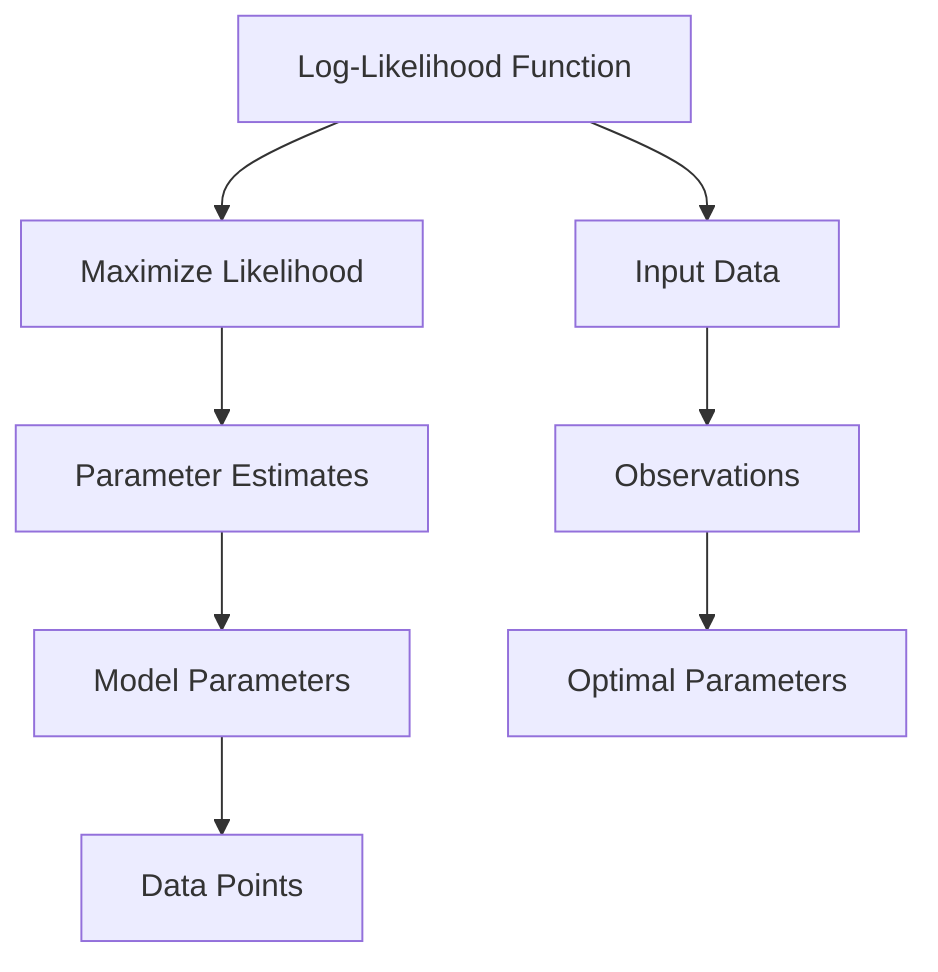
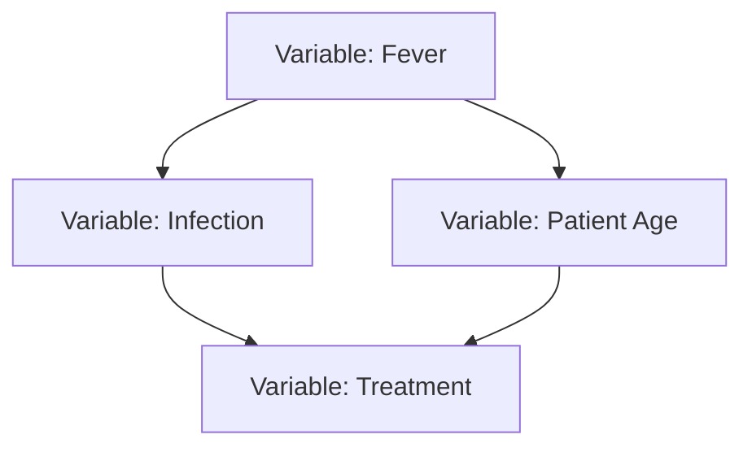
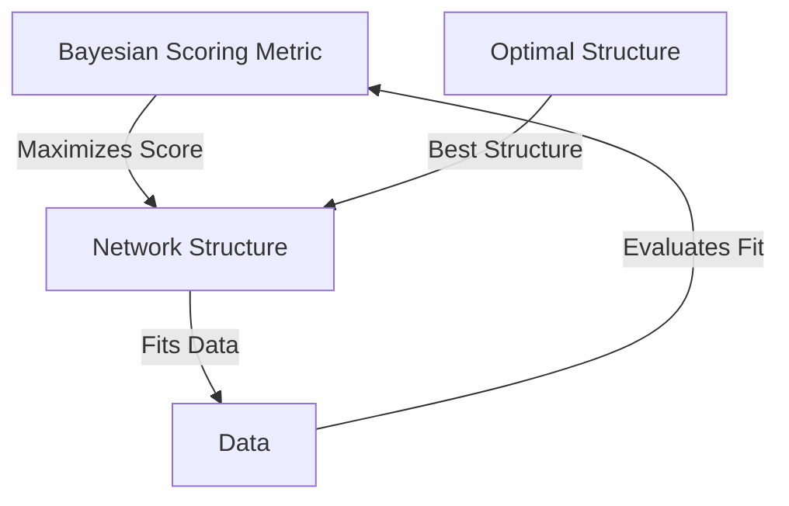
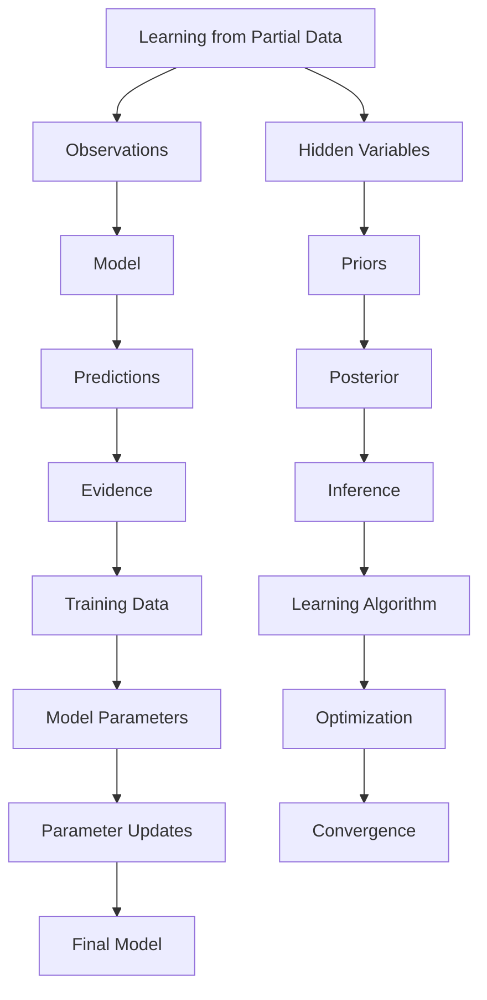
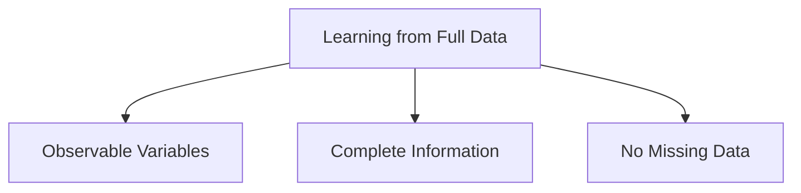
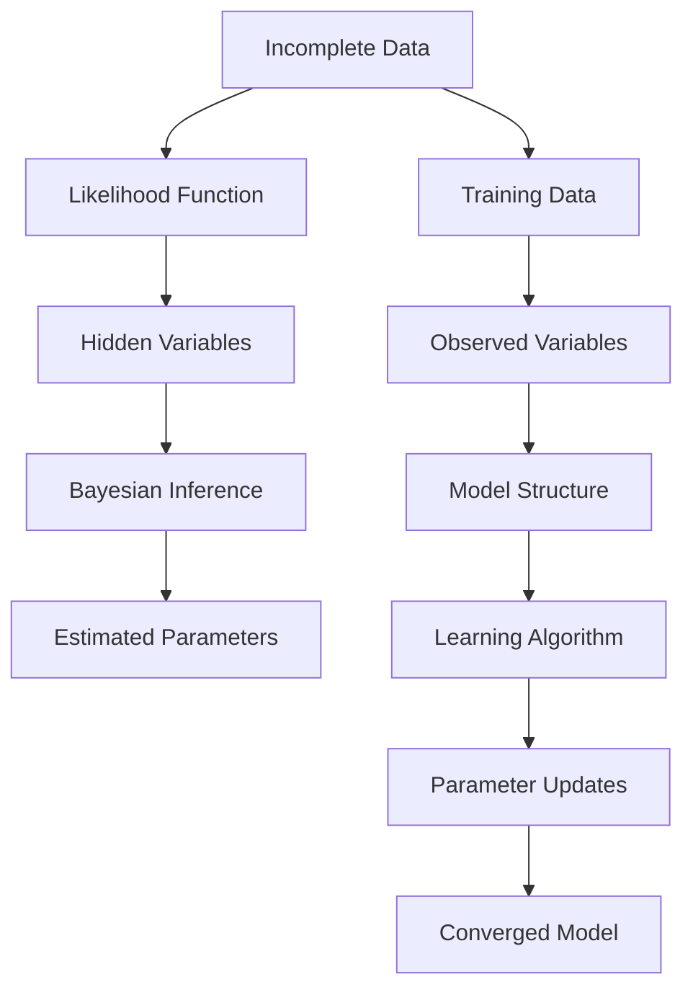
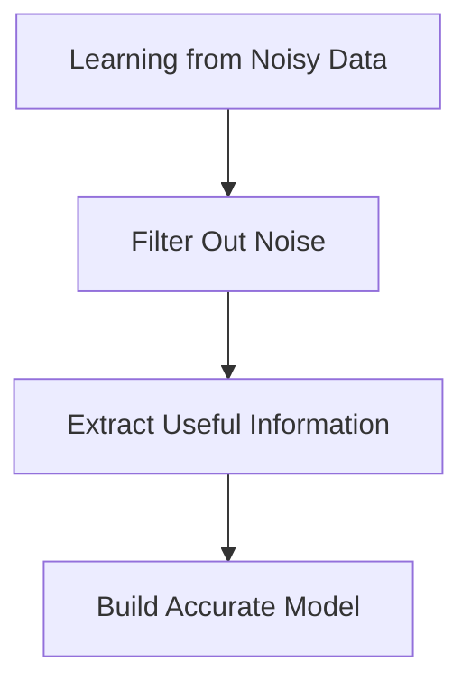
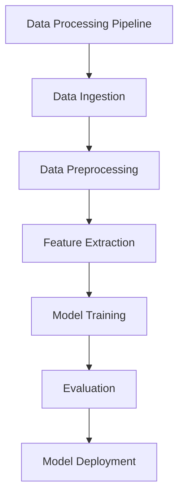

# Machine Learning: Machine Learning
*Generated 2026-03-31 · iMentor Lecture Generator · Local SGLang*

---

## Overview

An introductory text on primary approaches to machine learning, covering algorithms that improve automatically through experience. The book introduces basics concepts from statistics, artificial intelligence, information theory, and other disciplines as needed, with balanced coverage of theory and practice.

### Learning Objectives

- Understand the core concepts of machine learning
- Learn about different types of learning algorithms
- Explore the theory and practice of machine learning
- Apply learning algorithms to real-world problems

---

## Concept Map

> Interactive concept map: [concept_map.html](concept_map.html)

## Contents

1. [Machine Learning](#machine-learning) — *core*
2. [Bayesian Networks](#bayesian-networks) — *core*
3. [Learning Algorithms](#learning-algorithms) — *core*
4. [Algorithms](#algorithms) — *core*
5. [Learning from Data](#learning-from-data) — *core*
6. [Conditional Probability Tables](#conditional-probability-tables) — *supporting*
7. [Gradient Ascent](#gradient-ascent) — *supporting*
8. [Training Data](#training-data) — *supporting*
9. [Hidden Units](#hidden-units) — *supporting*
10. [Naive Bayes Classifier](#naive-bayes-classifier) — *supporting*
11. [Artificial Neural Networks](#artificial-neural-networks) — *supporting*
12. [Information Theory](#information-theory) — *supporting*
13. [Statistical Methods](#statistical-methods) — *supporting*
14. [Experience](#experience) — *supporting*
15. [Bayesian Inference](#bayesian-inference) — *supporting*
16. [Training Examples](#training-examples) — *supporting*
17. [Hidden Variables](#hidden-variables) — *supporting*
18. [Maximum Likelihood](#maximum-likelihood) — *supporting*
19. [Bayesian Networks Structure](#bayesian-networks-structure) — *supporting*
20. [Learning Algorithms for Bayesian Networks](#learning-algorithms-for-bayesian-networks) — *supporting*
21. [Learning from Partial Data](#learning-from-partial-data) — *supporting*
22. [Learning from Full Data](#learning-from-full-data) — *supporting*
23. [Learning from Incomplete Data](#learning-from-incomplete-data) — *supporting*
24. [Learning from Noisy Data](#learning-from-noisy-data) — *supporting*
25. [Learning from Large Data Sets](#learning-from-large-data-sets) — *supporting*

---

## 1. Machine Learning {#machine-learning}

### Definition

The study of algorithms that allow computer programs to automatically improve through experience.

### Intuition

Imagine you're teaching a computer to recognize dogs. Initially, it might struggle to distinguish between cats and dogs. However, as it sees more and more examples of dogs, it starts to get better at recognizing them. This is the essence of machine learning: the computer learns from its experiences, much like how we learn from our own experiences. Just as you might improve at playing a game by practicing, a machine learning algorithm can improve its performance by processing more data.

### Diagram

*A simple flowchart illustrating the process of machine learning, where the learning algorithm processes training data to improve the model's performance through experience.*

### Examples

#### Dog Recognition Example

Imagine you have a dataset of images labeled as 'dog' or 'not dog'. A machine learning algorithm, such as a Convolutional Neural Network (CNN), can be trained on this dataset. Initially, the CNN might misclassify many images. However, as it sees more examples, it gradually improves its accuracy in recognizing dogs. This process of improving through experience is the core of machine learning.

#### Email Spam Filtering Example

An email service can use machine learning to filter spam emails. Initially, the system might rely on predefined rules. However, as it sees more emails and learns from user feedback (whether an email was marked as spam or not), it can adapt its filtering criteria to better distinguish between spam and legitimate emails. This continuous improvement through experience is a hallmark of machine learning.

### Key Takeaways

- Machine learning involves algorithms that improve through experience.
- The process of learning is iterative, with the model's performance improving as it sees more data.
- Experience can come in the form of labeled data, user feedback, or any other source of information.

### Common Misconceptions

- ⚠️ Misconception: Machine learning is only about predicting outcomes. 
Correction: While prediction is a common application, machine learning also includes tasks like clustering, classification, and regression. The goal is to learn from data, not just to predict.
- ⚠️ Misconception: All machine learning requires a large amount of data. 
Correction: While many modern techniques do require large datasets, there are methods that can work with limited data, such as transfer learning or semi-supervised learning.

---

## 2. Bayesian Networks {#bayesian-networks}

> ⚠️ Note generation failed for this concept.

A probabilistic graphical model that represents a set of random variables and their conditional dependencies via a directed acyclic graph.

---

## 3. Learning Algorithms {#learning-algorithms}

> ⚠️ Note generation failed for this concept.

Algorithms designed to improve automatically through experience.

---

## 4. Algorithms {#algorithms}

> ⚠️ Note generation failed for this concept.

Step-by-step procedures for solving a problem or performing a task.

---

## 5. Learning from Data {#learning-from-data}

> ⚠️ Note generation failed for this concept.

The process of using data to improve the performance of a machine learning model.

---

## 6. Conditional Probability Tables {#conditional-probability-tables}

> ⚠️ Note generation failed for this concept.

Tables that specify the probability of each possible combination of values of the variables in a Bayesian network.

---

## 7. Gradient Ascent {#gradient-ascent}

> ⚠️ Note generation failed for this concept.

A first-order iterative optimization algorithm for finding a local maximum of a differentiable function.

---

## 8. Training Data {#training-data}

> ⚠️ Note generation failed for this concept.

Data used to train a machine learning model.

---

## 9. Hidden Units {#hidden-units}

> ⚠️ Note generation failed for this concept.

Nodes in a neural network that are not directly observable.

---

## 10. Naive Bayes Classifier {#naive-bayes-classifier}

> ⚠️ Note generation failed for this concept.

A simple probabilistic classifier based on applying Bayes' theorem with strong (naive) independence assumptions.

---

## 11. Artificial Neural Networks {#artificial-neural-networks}

> ⚠️ Note generation failed for this concept.

A computational model inspired by the structure and function of the brain.

---

## 12. Information Theory {#information-theory}

> ⚠️ Note generation failed for this concept.

A branch of mathematics concerned with quantifying information.

---

## 13. Statistical Methods {#statistical-methods}

> ⚠️ Note generation failed for this concept.

Techniques for analyzing and interpreting data.

---

## 14. Experience {#experience}

> ⚠️ Note generation failed for this concept.

The process of learning and improving through practice.

---

## 15. Bayesian Inference {#bayesian-inference}

> ⚠️ Note generation failed for this concept.

A method of statistical inference where Bayes' theorem is used to update the probability for a hypothesis as more evidence or information becomes available.

---

## 16. Training Examples {#training-examples}

> ⚠️ Note generation failed for this concept.

Examples used to train a machine learning model.

---

## 17. Hidden Variables {#hidden-variables}

> ⚠️ Note generation failed for this concept.

Variables in a model that are not directly observable.

---

## 18. Maximum Likelihood {#maximum-likelihood}

### Definition

A method of estimating the parameters of a statistical model by finding the parameter values that maximize the likelihood of the observed data.

### Intuition

Imagine you have a bag of marbles, and you want to guess the proportion of red and blue marbles in the bag. Maximum Likelihood is like guessing the proportions that would make your observed sample of marbles the most probable. If you draw 10 red and 5 blue marbles, you might guess that the bag has a higher proportion of red marbles. Maximum Likelihood would find the exact proportions that make this observation the most likely. It's like solving a puzzle where the pieces are the parameters of your model, and the picture you're trying to complete is the observed data.

### Mathematical Formulation

**Log-Likelihood Function**

$$
\mathcal{L}(\theta) = \sum_{i=1}^{n} \log p(y^{(i)}|x^{(i)};\theta)
$$

*The log-likelihood function is the sum of the logarithms of the probability of each data point given the model parameters. Maximizing this function is equivalent to maximizing the likelihood function.*

**Probability Expression**

$$
p(y|x;\theta) = \frac{e^{\theta_l^T x^{(i)}}}{\sum_{j=1}^{k} e^{\theta_j^T x^{(i)}}} 1\{y^{(i)}=l\}
$$

*This expression represents the probability of observing the data point $y^{(i)}$ given the input $x^{(i)}$ and the model parameters $\theta$. The numerator is the exponential of the dot product of the parameter vector and the input vector, and the denominator is the sum of exponentials for all possible classes.*

### Diagram

*Flowchart illustrating the process of maximizing the log-likelihood function to find the optimal parameters for a given model.*

### Examples

#### Example 1: Bayesian Network

Consider a Bayesian network where we want to learn the conditional probabilities of a node given its parents. Using the Maximum Likelihood approach, we can write the log-likelihood function as $\mathcal{L}(\theta) = \sum_{i=1}^{n} \log p(y^{(i)}|x^{(i)};\theta)$. By maximizing this function, we can find the parameters that best fit the observed data.

#### Example 2: Linear Model

For a linear model, the probability of observing a data point $y^{(i)}$ given the input $x^{(i)}$ and the model parameters $\theta$ can be expressed as $p(y|x;\theta) = \frac{e^{\theta_l^T x^{(i)}}}{\sum_{j=1}^{k} e^{\theta_j^T x^{(i)}}} 1\{y^{(i)}=l\}$. By maximizing the log-likelihood function, we can find the optimal parameters for the linear model.

### Key Takeaways

- Maximum Likelihood is a method for estimating the parameters of a statistical model by maximizing the likelihood of the observed data.
- The log-likelihood function is often used to simplify the calculations involved in maximizing the likelihood function.
- Maximum Likelihood can find local optima, not necessarily the global optimum.

### Common Misconceptions

- ⚠️ Misconception: Maximum Likelihood always finds the global optimum.
Correction: Maximum Likelihood can only find a local optimum, and it is not guaranteed to find the global optimum.
- ⚠️ Misconception: Maximum Likelihood is the only method for estimating model parameters.
Correction: There are other methods such as Bayesian Inference, which can provide a more comprehensive approach by incorporating prior knowledge.

---

## 19. Bayesian Networks Structure {#bayesian-networks-structure}

### Definition

A Bayesian Network is a probabilistic graphical model that represents a set of variables and their conditional dependencies via a directed acyclic graph (DAG). Each node in the graph corresponds to a random variable, and the edges represent the conditional dependencies between these variables. The structure of a Bayesian Network encodes the joint probability distribution over the variables in a factorized form, allowing for efficient computation of probabilities and inference.

### Intuition

Imagine a network of interconnected nodes, where each node represents a variable in your system. The edges between nodes indicate that one variable directly influences another. For example, in a medical diagnosis system, a node for 'Fever' might influence a node for 'Infection', but not a node for 'Patient Age'. This structure allows us to model complex relationships in a simple and intuitive way, making it easier to understand and analyze the system as a whole.

### Diagram

*A simple Bayesian Network illustrating the dependencies between variables. Nodes represent variables, and directed edges represent conditional dependencies.*

### Examples

#### Medical Diagnosis System

Consider a Bayesian Network for diagnosing diseases. Nodes include 'Fever', 'Cough', 'Sore Throat', and 'Infection'. The structure encodes dependencies such as 'Fever' and 'Cough' influencing 'Infection', but not directly influencing 'Patient Age'. This allows for efficient computation of the probability of an infection given the presence of fever and cough.

### Key Takeaways

- A Bayesian Network structure encodes the conditional dependencies between variables in a probabilistic graphical model.
- The structure allows for efficient computation and inference of probabilities.
- Nodes represent variables, and directed edges represent conditional dependencies.

### Common Misconceptions

- ⚠️ Misconception: A Bayesian Network must be fully observable to learn its structure. 
Correction: Algorithms like K2 can learn the structure of Bayesian Networks even when the data is not fully observable, using a heuristic search approach.
- ⚠️ Misconception: The structure of a Bayesian Network is always known in advance. 
Correction: Learning the structure of a Bayesian Network is a challenging task, but algorithms like K2 can be used to infer the structure from data.

---

## 20. Learning Algorithms for Bayesian Networks {#learning-algorithms-for-bayesian-networks}

### Definition

Learning algorithms for Bayesian networks are designed to infer the parameters of a Bayesian network from given data. These algorithms are crucial for constructing probabilistic models that can make predictions and provide insights into complex systems.

### Intuition

Imagine you have a network of interconnected nodes, each representing a variable in a system. The edges between nodes indicate the conditional dependencies between these variables. Learning algorithms for Bayesian networks help us understand these dependencies and quantify the relationships between the variables. It's like putting together a puzzle where each piece (node) is connected to others based on the data we observe. The goal is to find the best configuration of these pieces to accurately represent the system.

### Mathematical Formulation

**Bayesian Scoring Metric**

$$
$S(\mathcal{G}) = \sum_{i} \log p(y_i | \mathcal{G}) - \frac{1}{2} \sum_{i} \log |J_i| - \frac{1}{2} \sum_{i} \text{tr}(J_i)$
$$

*The Bayesian scoring metric evaluates the goodness of fit of a network structure $\mathcal{G}$ to the data. Here, $y_i$ represents the observed data, $p(y_i | \mathcal{G})$ is the probability of the data given the network structure, and $J_i$ is the Fisher information matrix.*

**K2 Algorithm**

$$
$\mathcal{G}_{\text{best}} = \text{argmax}_{\mathcal{G}} S(\mathcal{G})$
$$

*The K2 algorithm selects the network structure $\mathcal{G}_{\text{best}}$ that maximizes the Bayesian scoring metric $S(\mathcal{G})$.*

### Diagram

*A flowchart illustrating the process of using a Bayesian scoring metric to evaluate and select the optimal network structure for a given dataset.*

### Examples

#### Cooper and Herskovits' Bayesian Scoring Metric

Cooper and Herskovits (1992) proposed a Bayesian scoring metric to evaluate the goodness of fit of a network structure to the data. This metric takes into account the likelihood of the data given the structure, the complexity of the structure, and the Fisher information matrix. The goal is to find the structure that maximizes this score.

#### K2 Algorithm for Learning Network Structure

The K2 algorithm is a heuristic search algorithm designed to learn the structure of a Bayesian network. It performs a greedy search to find the structure that maximizes the Bayesian scoring metric. The algorithm starts with a single node and iteratively adds nodes to the network, selecting the next node based on the highest increase in the score.

### Key Takeaways

- Understand the role of Bayesian scoring metrics in evaluating the goodness of fit of a network structure to the data.
- Learn how the K2 algorithm uses a greedy search to find the optimal network structure.
- Recognize the importance of balancing model complexity and data fit in learning algorithms for Bayesian networks.

### Common Misconceptions

- ⚠️ Misconception: Learning algorithms for Bayesian networks can always find the exact optimal structure. 
Correction: While these algorithms aim to find the best structure, they may not always converge to the global optimum due to the complexity of the search space and the presence of local optima.
- ⚠️ Misconception: The Bayesian scoring metric is the only method for evaluating network structures. 
Correction: There are various scoring metrics and algorithms, such as BIC, AIC, and others, that can be used to evaluate the goodness of fit of a network structure.

---

## 21. Learning from Partial Data {#learning-from-partial-data}

### Definition

The process of learning from data where some variables are unobservable, meaning they are hidden or missing from the dataset.

### Intuition

Imagine you're trying to predict the weather, but you only have temperature and humidity data. The wind speed, which is crucial for predicting weather, is missing. In this scenario, you're dealing with 'hidden variables'—factors that influence the outcome but are not directly observable. Learning from such data requires inferring the missing information based on the available data and using probabilistic models to make predictions.

### Diagram

*Diagram illustrating the process of learning from partial data, where hidden variables are inferred using a model and priors, leading to predictions and parameter updates.*

### Examples

#### Bayesian Networks

Consider a Bayesian network where you want to predict the likelihood of a disease (D) based on symptoms (S1, S2) and a hidden variable (H) representing the patient's genetic predisposition. Using the available data (S1, S2), you can infer the hidden variable (H) and update the probabilities of the disease (D) using Bayesian inference.

#### Hidden Units in Neural Networks

In an artificial neural network, hidden units represent unobservable factors that influence the output. For example, in a speech recognition task, the hidden units might represent phonemes that are not directly observable but are inferred from the audio signal.

### Key Takeaways

- Understanding that hidden variables are crucial for accurate predictions and that they can be inferred using probabilistic models.
- Recognizing that learning from partial data involves updating the model parameters based on the available data and the inferred hidden variables.
- Knowing that the process of learning from partial data is iterative, involving inference, updating, and convergence.

### Common Misconceptions

- ⚠️ Misconception: Hidden variables are always unobservable and cannot be inferred. 
Correction: Hidden variables can often be inferred using probabilistic models and priors, even if they are not directly observable in the data.
- ⚠️ Misconception: Learning from partial data is only applicable in Bayesian networks. 
Correction: Learning from partial data is a general concept applicable in various models, including neural networks and other probabilistic graphical models.

---

## 22. Learning from Full Data {#learning-from-full-data}

### Definition

The process of learning from data where all variables are observable, meaning that every variable in the dataset can be directly measured or observed without any missing or hidden values.

### Intuition

Imagine you are trying to learn the rules of a game. In the simplest scenario, you have a complete set of instructions that tell you exactly how to play. Each rule is clearly defined, and you can see all the pieces on the board. This is analogous to learning from full data, where you have all the necessary information to make accurate predictions or decisions. In contrast, if some pieces are missing or some rules are hidden, you would need to infer them, which is more complex and less straightforward.

### Diagram

*Diagram illustrating the concept of learning from full data, where all variables are observable and complete information is available.*

### Examples

#### Example 1: Predicting Weather Conditions

Suppose you are building a model to predict the weather based on various factors such as temperature, humidity, and wind speed. If you have a dataset where all these variables are fully observable for each day, you can use this data to train your model. For instance, if you have a dataset for the past 100 days with all these variables measured accurately, you can use this full data to learn the relationships between these factors and the weather conditions.

#### Example 2: Computer Vision Tasks

In computer vision, if you are training a model to recognize objects in images, and all the relevant features (such as edges, textures, and colors) are clearly visible in each training example, you can use this full data to learn the patterns that correspond to different objects. For example, if you have a dataset of images where each image is labeled with all the objects present, you can use this full data to train your model to accurately recognize objects.

### Key Takeaways

- Understanding that learning from full data means having all variables observable and complete information available.
- Recognizing that this type of learning is simpler and more straightforward compared to scenarios with missing or hidden data.
- Knowing that this concept is foundational in machine learning and is often used as a basis for more complex learning tasks.

### Common Misconceptions

- ⚠️ Misconception: Learning from full data is always the best approach. 
Correction: While learning from full data is straightforward, it is not always available in real-world scenarios. In many cases, data may be incomplete or contain missing values, and more advanced techniques are needed to handle such situations effectively.
- ⚠️ Misconception: All machine learning models require full data. 
Correction: Many machine learning models can handle incomplete or noisy data, and some models are specifically designed to work with such data. Understanding the limitations of full data can help in choosing the right model for a given task.

---

## 23. Learning from Incomplete Data {#learning-from-incomplete-data}

### Definition

The process of learning from data where some variables are unobservable, often requiring the use of probabilistic models and inference techniques to estimate the missing information.

### Intuition

Imagine you have a set of data points, but some of the features are missing or hidden. Just like solving a puzzle with some pieces missing, you need to use the available information to infer the missing parts. This is where Bayesian networks and other probabilistic models come in handy. They allow us to model the relationships between observed and hidden variables, making predictions and filling in the gaps based on the data we have.

### Diagram

*A flowchart illustrating the process of learning from incomplete data using a Bayesian network. The model structure and learning algorithm are used to update parameters based on the observed and inferred data.*

### Examples

#### Example 1: Learning Bayesian Networks

Consider a Bayesian network where some of the variables are hidden. Suppose we have a dataset of patients with symptoms and diagnoses, but some diagnoses are missing. We can use the available data to estimate the missing diagnoses using Bayesian inference. The likelihood function is used to calculate the probability of the observed data given the hidden variables, and the parameters of the network are updated to maximize this probability.

#### Example 2: Hidden Units in Neural Networks

In an artificial neural network, some hidden units might not be directly observable. For instance, in a deep learning model for image recognition, the hidden units in the early layers might represent low-level features like edges and corners, which are not directly observable in the input image. The network learns to infer these hidden features from the input data, allowing it to make predictions about the image's content.

### Key Takeaways

- Learning from incomplete data requires the use of probabilistic models and inference techniques to estimate the missing information.
- Bayesian networks and other probabilistic models can be used to model the relationships between observed and hidden variables.
- The process involves using the likelihood function to calculate the probability of the observed data and updating the parameters of the model to maximize this probability.

### Common Misconceptions

- ⚠️ Misconception: Incomplete data means the data is corrupted or missing entirely. 
Correction: Incomplete data simply means that some variables are unobservable or missing, but the data is still usable for learning and inference.
- ⚠️ Misconception: Learning from incomplete data is impossible. 
Correction: While it can be challenging, it is possible to learn from incomplete data using probabilistic models and inference techniques.

---

## 24. Learning from Noisy Data {#learning-from-noisy-data}

### Definition

The process of learning from data that contains errors or inaccuracies, which can hinder the accuracy of the model's predictions and generalization capabilities.

### Intuition

Imagine you are trying to learn the rules of a game by observing other players. However, some of the players are not following the rules correctly, and some of them are even making up their own rules. This is similar to learning from noisy data, where the data you have is not entirely accurate or complete. Just as you would need to filter out the incorrect observations and focus on the correct ones to learn the true rules of the game, you need to filter out the incorrect data points and focus on the correct ones to build an accurate model.

### Diagram

*Diagram illustrating the process of learning from noisy data, including filtering out noise and extracting useful information to build an accurate model.*

### Examples

#### Example 1: Learning Bayesian Networks from Noisy Data

Consider a scenario where we are trying to learn the structure of a Bayesian network from training data. The training data is noisy, meaning that some of the data points are incorrect or incomplete. To address this, we can use algorithms that are designed to handle noisy data, such as the Expectation-Maximization (EM) algorithm. The EM algorithm iteratively estimates the parameters of the Bayesian network and then maximizes the likelihood of the data, effectively filtering out the noise and extracting the useful information.

#### Example 2: Clustering Noisy Data Points

Suppose we have a dataset of customer purchase histories, but some of the data points are incorrect or incomplete. For instance, some customers might have made purchases that are not recorded in the dataset, or some purchases might be incorrectly recorded. To address this, we can use clustering algorithms, such as the K-means algorithm, to group similar data points together. By doing so, we can filter out the noise and extract the useful information, which can help us understand the underlying patterns in the data.

### Key Takeaways

- Understanding the importance of filtering out noise and extracting useful information from noisy data is crucial for building accurate models.
- Various algorithms and techniques, such as the EM algorithm and clustering algorithms, can be used to handle noisy data and improve the accuracy of the model.
- The process of learning from noisy data involves multiple steps, including filtering out noise, extracting useful information, and building an accurate model.

### Common Misconceptions

- ⚠️ Misconception: Learning from noisy data is impossible. Correction: While it is more challenging, it is not impossible. With the right techniques and algorithms, we can effectively filter out the noise and build accurate models.
- ⚠️ Misconception: All noisy data is equally problematic. Correction: Some types of noise, such as random errors, can be more easily filtered out than others, such as systematic errors or missing data. Understanding the nature of the noise is crucial for developing effective strategies to handle it.

---

## 25. Learning from Large Data Sets {#learning-from-large-data-sets}

### Definition

The process of learning from data sets that are too large to be processed in a single run. This involves developing algorithms and techniques to handle and learn from vast amounts of data efficiently.

### Intuition

Imagine you have a library with millions of books, and you need to find a specific piece of information. Instead of reading every book, you can use a smart indexing system to quickly locate the relevant pages. Similarly, in machine learning, we use algorithms to efficiently process and learn from large data sets without needing to analyze every single data point. This is crucial for modern applications where data is abundant and continuously growing.

### Diagram

*A flowchart illustrating the process of learning from large data sets, from data ingestion to model deployment.*

### Examples

#### Learning Bayesian Networks from Large Data Sets

Consider a scenario where we want to learn the structure of a Bayesian network from a large data set. One approach is to use constraint-based methods, such as the PC algorithm, which can efficiently infer the network structure by testing conditional independencies among variables. Another approach is score-based methods, such as the Bayesian Information Criterion (BIC), which evaluate the goodness of fit of different network structures and select the best one.

#### Learning Polynomial Functions from Large Data Sets

Suppose we have a large data set and want to fit a polynomial function to it. If the polynomial degree is too high, the model may overfit the data, meaning it will perform well on the training data but poorly on new, unseen data. Conversely, if the degree is too low, the model may underfit. To find the optimal degree, we can use techniques like cross-validation to evaluate the model's performance on different subsets of the data.

### Key Takeaways

- Understanding the challenges and techniques for learning from large data sets is crucial for modern machine learning applications.
- Efficient algorithms and techniques are necessary to handle and learn from vast amounts of data without overfitting.
- Various methods, such as constraint-based and score-based approaches, can be used to learn the structure of Bayesian networks from large data sets.

### Common Misconceptions

- ⚠️ Misconception: Learning from large data sets always requires more computational resources. 
Correction: While large data sets can be computationally intensive, efficient algorithms and techniques can significantly reduce the required resources. Techniques like data sampling, dimensionality reduction, and distributed computing can help manage the computational load.
- ⚠️ Misconception: Overfitting is a problem only when the data set is small. 
Correction: Overfitting can occur with large data sets as well, especially if the model is too complex. Techniques like regularization, cross-validation, and model selection can help prevent overfitting.

---

*End of lecture notes: Machine Learning: Machine Learning*
