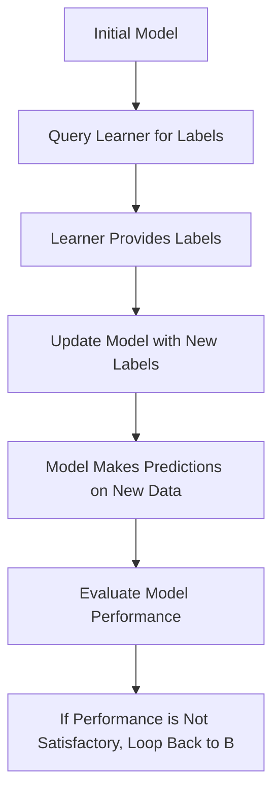

## Active Learning

### Definition
Active learning is a method where the learner actively participates in the learning process, often by making predictions or providing feedback, which is then used to refine the model. This approach is particularly useful in scenarios where labeled data is scarce or expensive to obtain.

### Intuition
Imagine you are trying to learn to identify different types of flowers. In traditional supervised learning, you would be given a large dataset of labeled flowers, where each flower is already categorized. However, in active learning, you would start with a small set of labeled flowers and then ask a knowledgeable person (the learner) to help you. The learner might show you a few more flowers and label them, which you then use to improve your model. This process continues, with you asking the learner for more labels as needed, until your model can accurately classify new flowers on its own. This approach is more efficient because you don't need to label all the flowers upfront; instead, you focus on the most informative ones.

Another analogy is a game where you are trying to guess a number between 1 and 100. In traditional learning, you would guess randomly and check if you are right. In active learning, you can ask the game to give you hints (feedback) about whether your guess is too high or too low, which helps you refine your guesses more efficiently.

### Mathematical Foundation
This concept is primarily qualitative — no specific formula is needed.

### Diagram

*Diagram Caption: An iterative process of active learning where the model is updated based on learner feedback.*

### Worked Example

**Problem:** Suppose we have a binary classification problem where we want to classify emails as spam or not spam. Initially, we have a small set of labeled emails. Using an active learning approach, we can query the learner (a human in this case) to label a few emails. Based on the learner's feedback, we update our model and then query the learner again for more labels. This iterative process continues until the model achieves satisfactory performance.

**Solution:**
1. **Initialize Model:** Start with a basic spam classifier, such as a Naive Bayes classifier, using a small set of labeled emails.
2. **Query Learner for Labels:** Select a few emails that the model is unsure about and ask the learner to label them. For example, if the model is uncertain about an email, it can ask the learner if it is spam or not.
3. **Update Model with New Labels:** Incorporate the learner's feedback into the model. For instance, if the learner confirms that an email is spam, update the model's parameters to reflect this new information.
4. **Repeat Process:** Continue querying the learner for more labels and updating the model until the model's performance on a validation set is satisfactory.
5. **Evaluate Model Performance:** Test the model on a new set of emails to ensure it generalizes well.

### Key Takeaways
- The learner actively participates in the learning process.
- Feedback from the learner is used to refine the model.
- Effective in scenarios with limited labeled data.
- Can significantly reduce the need for labeled data.

### Common Misconceptions
- ⚠️ **Misconception:** Active learning is the same as interactive learning, where the learner is simply asked questions. **Correction:** Active learning involves the learner providing feedback to refine the model, not just answering questions.
- ⚠️ **Misconception:** Active learning always requires human intervention. **Correction:** While human intervention is common, active learning can also involve automated systems querying other models or databases for feedback.