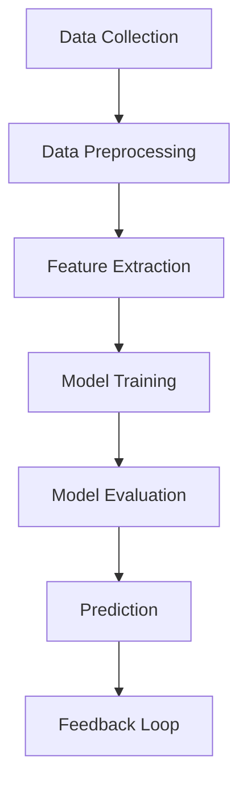

## Definition of ML

### Definition
Machine Learning is a subset of artificial intelligence that involves building models to make predictions or decisions based on data. Essentially, it's about teaching computers to learn from examples and improve their performance over time.

### Intuition
Imagine you're trying to teach a computer to recognize cats in photos. At first, you show it many pictures and label them as "cat" or "not cat." Over time, the computer starts to understand what features are important—like pointy ears or whiskers—and uses this knowledge to predict whether new images contain cats. This is akin to how you might learn to play a musical instrument: by practicing, you get better at identifying the right notes and rhythms.

### Mathematical Foundation
This concept is primarily qualitative — no specific formula is needed. However, understanding the basics of functions and patterns is crucial. In a simple case, a linear model can be represented as:

$$
y = mx + b
$$

Here, \(y\) is the predicted output, \(m\) is the slope indicating the rate of change, \(x\) is the input feature, and \(b\) is the y-intercept. While this is a basic example, it illustrates how a model can learn from data to make predictions.

### Diagram

*Diagram Caption: A flowchart illustrating the Machine Learning process from data collection to model evaluation and prediction.*

### Worked Example

**Problem:** Develop a model to predict house prices based on features like square footage, number of bedrooms, and location.

**Solution:**
1. **Data Collection:** Gather a dataset containing various houses with their features and prices.
2. **Data Preprocessing:** Clean the data by handling missing values and outliers.
3. **Feature Extraction:** Use techniques like normalization and encoding to prepare the data.
4. **Model Training:** Split the data into training and testing sets. Train a linear regression model using the training set.
5. **Model Evaluation:** Evaluate the model's performance on the testing set using metrics like Mean Squared Error (MSE).
6. **Prediction:** Use the trained model to predict house prices for new data.
7. **Feedback Loop:** Continuously update the model with new data to improve its accuracy.

### Key Takeaways
- Models are trained on data to learn patterns and make predictions.
- The goal is to improve performance over time as more data is processed.
- Machine Learning encompasses both supervised and unsupervised learning methods.
- Understanding the basics of Machine Learning is crucial for exploring more complex models and techniques.

### Common Misconceptions
- ⚠️ **Misconception:** Machine Learning can solve any problem without human intervention. **Correction:** While Machine Learning can automate many tasks, it still requires careful design, data preparation, and ongoing monitoring.
- ⚠️ **Misconception:** All Machine Learning models are equally effective for any task. **Correction:** The effectiveness of a model depends on the specific task, the quality of the data, and the choice of algorithm.