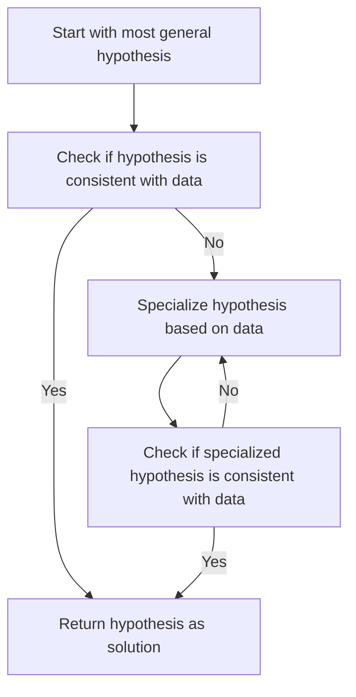

## Find-S Algorithm

### Definition
The Find-S algorithm is a simple, iterative method used in inductive learning to find a set of rules that describe a given set of data. It is a basic algorithm in machine learning that helps in identifying the most specific hypothesis that fits the training data. The algorithm starts with the most general hypothesis and gradually specializes it until it finds a hypothesis that is consistent with the training data.

### Intuition
To understand the Find-S algorithm, imagine you are trying to learn a new concept, such as recognizing different types of animals. At first, you might have a very general idea of what an animal is, but as you see more examples, you start to notice specific characteristics that distinguish one type of animal from another. The Find-S algorithm works in a similar way, starting with a very general hypothesis and then gradually refining it based on the data it sees. This process of refinement continues until the algorithm finds a hypothesis that accurately describes the data.

The Find-S algorithm is often used in decision tree learning, where the goal is to create a tree-like model that can classify data into different categories. The algorithm starts at the root of the tree and works its way down, adding more specific rules at each node until it reaches a leaf node that represents a specific class or category. This process of adding more specific rules is similar to the way a human might learn to recognize different types of animals, by gradually noticing more and more specific characteristics.

In real-world applications, the Find-S algorithm can be used in a variety of domains, such as text classification, image recognition, and recommender systems. For example, in text classification, the algorithm might start with a very general hypothesis that a piece of text is either positive or negative, and then gradually refine this hypothesis based on the specific words and phrases used in the text.

### Mathematical Foundation
This concept is primarily qualitative — no specific formula is needed. However, the algorithm can be described using a simple iterative formula:
$$
h_{i+1} = \text{Specialize}(h_i, D)
$$
where $h_i$ is the current hypothesis, $D$ is the training data, and $\text{Specialize}$ is a function that refines the hypothesis based on the data.

### Diagram

*The diagram illustrates the iterative process of refining the hypothesis until it is consistent with the data.*

### Worked Example
**Problem:** Suppose we want to learn a set of rules to classify animals as either mammals or non-mammals, based on the following characteristics: has fur, gives milk, has four legs, and can fly. The training data consists of the following examples:
- Cat: has fur, gives milk, has four legs, cannot fly (mammal)
- Dog: has fur, gives milk, has four legs, cannot fly (mammal)
- Bird: has feathers, does not give milk, has two legs, can fly (non-mammal)

**Solution:**
1. Start with the most general hypothesis: "All animals are mammals."
2. Check if the hypothesis is consistent with the data. Since the bird example does not fit this hypothesis, we need to specialize it.
3. Specialize the hypothesis based on the data: "All animals with fur and that give milk are mammals."
4. Check if the specialized hypothesis is consistent with the data. Since all the mammal examples fit this hypothesis, and the bird example does not, we can return this hypothesis as the solution.

### Key Takeaways
- The Find-S algorithm is a simple, iterative method for finding a set of rules that describe a given set of data.
- The algorithm starts with the most general hypothesis and gradually specializes it until it finds a hypothesis that is consistent with the training data.
- The algorithm is often used in decision tree learning and can be applied to a variety of domains, such as text classification and image recognition.
- The algorithm can be described using a simple iterative formula, but it is primarily a qualitative concept.

### Common Misconceptions
- ⚠️ **Misconception:** The Find-S algorithm always finds the optimal solution. **Correction:** The algorithm may not always find the optimal solution, as it depends on the quality of the training data and the specialization function used.
- ⚠️ **Misconception:** The Find-S algorithm is only used in decision tree learning. **Correction:** While the algorithm is often used in decision tree learning, it can be applied to other domains and machine learning tasks as well.