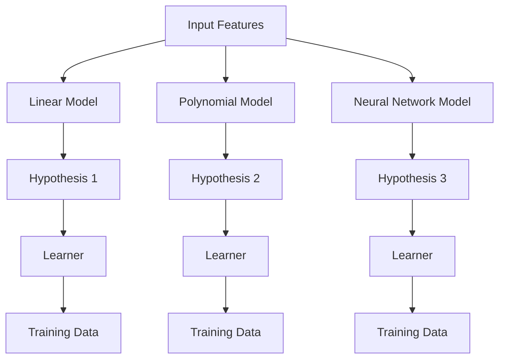

## Hypothesis Space

### Definition
A hypothesis space in machine learning is the set of all possible models or functions that can be used to solve a given problem. It encompasses all the potential solutions that can be explored during the learning process.

### Intuition
Imagine you are trying to predict the weather based on temperature and humidity. The hypothesis space would include all the possible functions that could map temperature and humidity to a weather prediction. For example, you might consider simple linear functions, polynomial functions, or even more complex neural networks. Each of these functions is a potential hypothesis in your hypothesis space.

Now, think about building a house. The hypothesis space for designing a house would include all the possible designs you could come up with. Some might be simple and straightforward, while others could be elaborate and intricate. Just as in machine learning, the size and complexity of your hypothesis space can greatly influence the final design of your house.

### Mathematical Foundation
This concept is primarily qualitative — no specific formula is needed.

### Diagram

*A visual representation of the hypothesis space, showing different models as potential solutions.*

### Worked Example

**Problem:** You are tasked with predicting house prices based on features such as the number of bedrooms, bathrooms, and square footage.

**Solution:**
1. **Define the Input Features:** The input features include the number of bedrooms, bathrooms, and square footage.
2. **Choose the Hypothesis Space:** Consider a linear model, a polynomial model, and a neural network.
3. **Train the Models:** Use a dataset of house prices to train each model.
4. **Evaluate the Models:** Compare the performance of each model on a validation set.
5. **Select the Best Model:** Choose the model that performs best on the validation set.

### Key Takeaways
- The hypothesis space encompasses all possible models or functions that can be used to solve a given problem.
- The size and complexity of the hypothesis space influence the learning process and the potential for overfitting or underfitting.
- Choosing a hypothesis space is a critical step in designing a machine learning algorithm.

### Common Misconceptions
- ⚠️ **Misconception:** The hypothesis space is the same as the model used for prediction. **Correction:** The hypothesis space is the set of all possible models, while the model used for prediction is just one specific function from that space.
- ⚠️ **Misconception:** A larger hypothesis space guarantees better performance on unseen data. **Correction:** A larger hypothesis space can lead to overfitting, where the model captures noise in the training data rather than the underlying patterns.