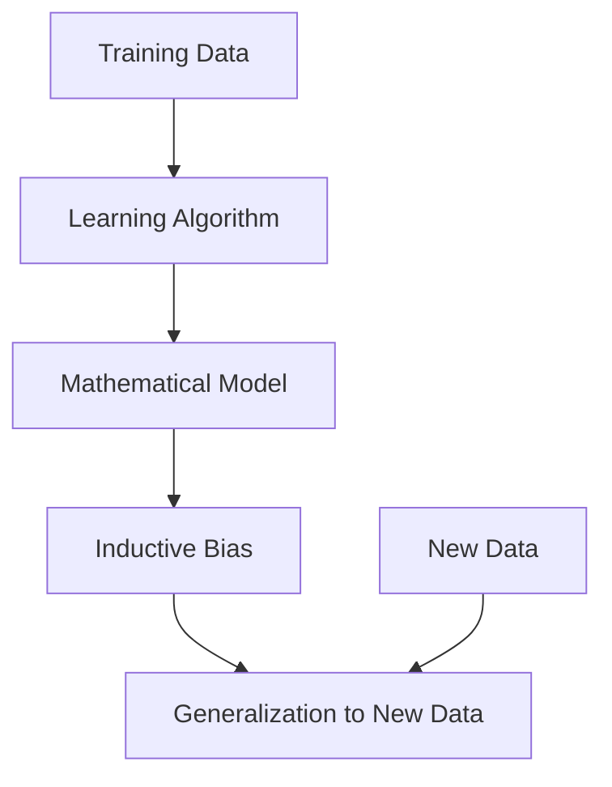

## Inductive Bias

### Definition
Inductive bias is the set of assumptions a learning algorithm uses to predict outcomes when faced with new data. These assumptions are inherent in the learning algorithm and guide the process of generalizing from the training data to unseen data.

### Intuition
Imagine you are trying to guess the next number in a sequence of numbers. If you see the sequence 2, 4, 6, 8, ..., you might assume the next number is 10 because you have inductive bias that the sequence is increasing by 2 each time. This is a simple example of inductive bias — the assumption that the pattern will continue. In machine learning, this is similar to choosing a linear regression model for predicting stock prices because you assume the relationship between the input features (like time) and the output (like stock price) is linear.

### Mathematical Foundation
This concept is primarily qualitative — no specific formula is needed. However, in the case of a linear regression model, the inductive bias is reflected in the equation:

$$
y = \beta_0 + \beta_1 x_1 + \beta_2 x_2 + \text{error}
$$

Here, $\beta_0$ is the intercept, $\beta_1$ and $\beta_2$ are the coefficients for the input features $x_1$ and $x_2$, and the error term represents the difference between the predicted and actual values.

### Diagram

*Diagram Caption: A flowchart illustrating how inductive bias guides the learning process from training data to predicting new data.*

### Worked Example

**Problem:** You are given a dataset of daily temperatures and the corresponding electricity consumption for a house. You want to build a model to predict electricity consumption based on temperature.

**Solution:**
1. **Data Preparation:** Assume you have a dataset with temperature ($x$) and electricity consumption ($y$).
2. **Choosing the Model:** You decide to use a linear regression model because you assume the relationship between temperature and electricity consumption is linear.
3. **Training the Model:** You use the training data to estimate the coefficients $\beta_0$ and $\beta_1$ in the equation $y = \beta_0 + \beta_1 x$.
4. **Evaluating the Model:** You test the model on a separate validation set to see how well it predicts electricity consumption based on temperature.
5. **Generalizing to New Data:** You use the trained model to predict electricity consumption for new days based on their temperatures.

### Key Takeaways
- Inductive bias is a fundamental aspect of machine learning algorithms that influences their ability to generalize.
- It reflects the assumptions and constraints that a learning algorithm imposes on the data.
- Inductive bias is not just about the choice of the model but encompasses a broader set of assumptions.

### Common Misconceptions
- ⚠️ **Misconception:** Inductive bias is the same as overfitting. **Correction:** Overfitting occurs when a model is too complex and captures noise in the training data, whereas inductive bias is a more general concept about the assumptions made by the model.
- ⚠️ **Misconception:** Inductive bias is only about the choice of the model. **Correction:** While the choice of the model is part of inductive bias, it also includes other assumptions such as the form of the error term or the distribution of the data.