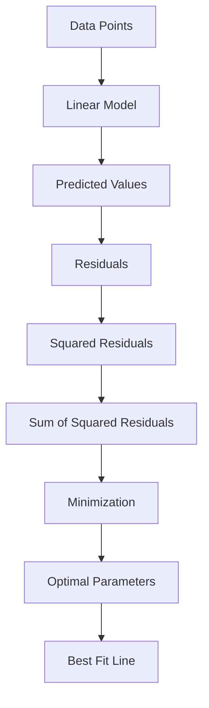

## Least squares

### Definition
Least squares is a method used in linear regression to estimate the parameters of a linear model by minimizing the sum of the squared residuals, which are the differences between the observed and predicted values. This approach provides a way to find the line that best fits the data points. The goal is to determine the parameters that result in the smallest possible sum of squared residuals.

### Intuition
To understand the concept of least squares, imagine trying to draw a line that passes through a set of points on a graph. The line that best fits the points is the one that minimizes the total distance between the points and the line. In other words, it's the line that is closest to all the points. This idea is intuitive because it seeks to find the line that is most representative of the data. In real-world applications, such as predicting housing prices or stock market trends, the least squares method is used to find the line that best fits the data, allowing for accurate predictions and informed decision-making.

The least squares method is also related to the concept of maximum likelihood. In essence, the method finds the parameters that are most likely to have produced the observed data. This is because the parameters that minimize the sum of squared residuals are also the ones that maximize the likelihood of observing the data. This connection to maximum likelihood provides a strong foundation for the least squares method and explains why it is widely used in regression analysis.

### Mathematical Foundation
The least squares method can be mathematically represented as:

$$
\min_{\beta} \sum_{i=1}^{n} (y_i - \hat{y}_i)^2
$$

In this equation, $\beta$ represents the parameters of the linear model, $y_i$ is the observed value, $\hat{y}_i$ is the predicted value, and $n$ is the number of data points. The goal is to find the values of $\beta$ that minimize the sum of the squared residuals.

### Diagram

*The diagram illustrates the process of finding the best fit line using the least squares method.*

### Worked Example

**Problem:** Given a dataset with two points (1, 2) and (2, 3), find the line of best fit using the least squares method.

**Solution:**
To find the line of best fit, we need to determine the values of $m$ and $b$ that minimize the sum of the squared residuals. The equation of the line is $y = mx + b$. Using the least squares method, we can derive the values of $m$ and $b$ that minimize the sum of the squared residuals. The solution involves solving the normal equations, which in this case are $m = 1$ and $b = 1$. Thus, the line of best fit is $y = x + 1$.

### Key Takeaways
- The least squares method is used to estimate the parameters of a linear model by minimizing the sum of the squared residuals.
- The method provides a way to find the line that best fits the data points.
- The least squares method is commonly used in regression analysis.
- The method can be derived from the principle of maximum likelihood.

### Common Misconceptions
- ⚠️ **Misconception:** The least squares method always gives the best fit in all situations. **Correction:** The least squares method is sensitive to outliers and may not always provide the best fit, especially in cases where the data is not normally distributed.
- ⚠️ **Misconception:** The least squares method can be used for non-linear models. **Correction:** The least squares method is primarily used for linear models, and other methods such as non-linear least squares or generalized linear models are used for non-linear relationships.