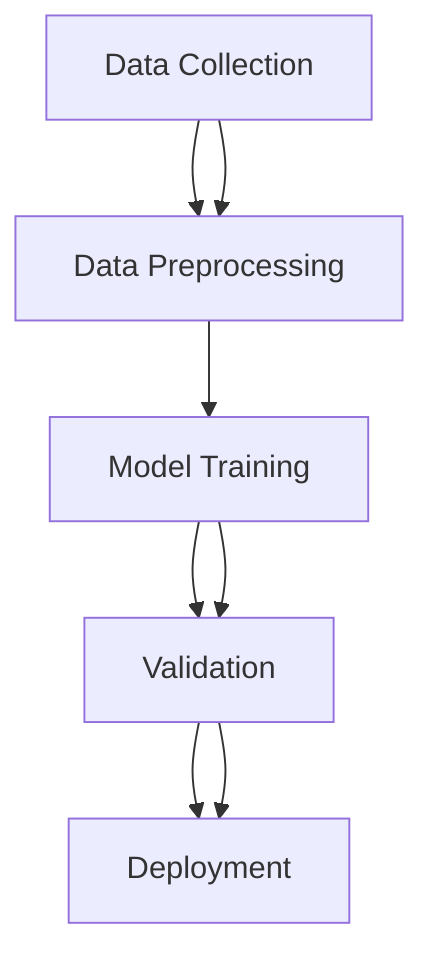

## ML pipeline

### Definition
An ML pipeline is a structured process that encompasses data collection, preprocessing, model training, validation, and deployment. It is essential for ensuring that the model performs well in real-world scenarios and is scalable.

### Intuition
Imagine you are building a bridge. Just as a bridge needs careful planning, design, and construction to ensure it can safely carry traffic, an ML model needs a well-defined pipeline to ensure it can accurately predict outcomes. The pipeline starts with collecting and preprocessing data, similar to how you would gather and clean materials for a bridge. Next, you choose and train a model, akin to designing and building the bridge's structure. Validation is like testing the bridge under various conditions to ensure it is safe and reliable. Finally, deploying the model is like opening the bridge to the public, where it must continue to function correctly over time.

### Mathematical Foundation
This concept is primarily qualitative — no specific formula is needed.

### Diagram

*A clear flowchart illustrating the ML pipeline.*

### Worked Example

**Problem:** Develop a model to predict whether an email is spam or not.

**Solution:**
1. **Data Collection:** Gather a dataset of emails, including both spam and non-spam examples.
2. **Data Preprocessing:** Remove stop words and convert text to numerical features using TF-IDF. For example, if we have 1000 emails, we might end up with a feature matrix of size 1000 x 10000.
3. **Model Training:** Train a logistic regression model on the preprocessed data. Suppose we use a learning rate of 0.01 and train for 1000 iterations.
4. **Validation:** Split the data into training and testing sets (e.g., 80% training, 20% testing). Use accuracy as the evaluation metric. Suppose the model achieves an accuracy of 95% on the testing set.
5. **Deployment:** Integrate the model into a web application that receives emails and predicts their spam status. Monitor the application to ensure the model continues to perform well over time.

### Key Takeaways
- Data collection and preprocessing are crucial for ensuring the model receives high-quality input data.
- Model training involves selecting an appropriate algorithm and optimizing its parameters.
- Validation is necessary to assess the model's performance and prevent overfitting.
- Deployment involves integrating the model into a production environment and monitoring its performance.

### Common Misconceptions
- ⚠️ **Misconception:** The model's performance is solely determined by the choice of algorithm. **Correction:** Data preprocessing and validation are equally important for ensuring the model's accuracy.
- ⚠️ **Misconception:** Once a model is trained, it can be immediately deployed without further validation or monitoring. **Correction:** Regular validation and monitoring are essential to ensure the model continues to perform well in the real world.