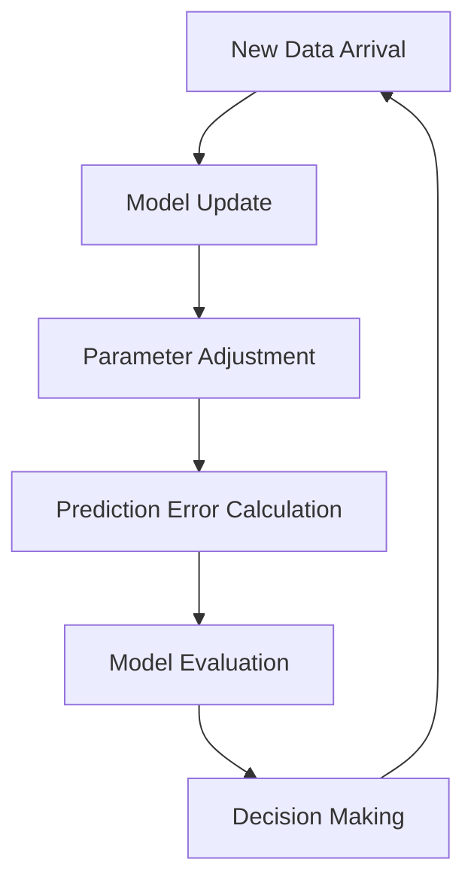

## Online Learning

### Definition
Online Learning is a machine learning paradigm where the model is updated incrementally as new data points arrive, rather than being trained on a fixed dataset. This approach enables models to adapt in real-time, making it suitable for applications with continuously generated data. Online Learning is particularly useful in dynamic environments where data is constantly changing.

### Intuition
Imagine a scenario where a company needs to predict stock prices. The stock market is highly dynamic, and new data points are constantly generated. If the company uses a traditional offline learning approach, it would need to retrain the model periodically, which is inefficient and impractical. Online Learning, on the other hand, allows the model to be updated incrementally as new data arrives, making it highly suitable for such dynamic environments. For instance, consider a self-driving car that needs to adapt to new road conditions in real-time. Online Learning enables the car's model to update its parameters based on new sensor data, ensuring safe and efficient navigation.

In real-world applications, Online Learning is crucial for maintaining model performance over time. As new data arrives, the model can update its parameters to reflect changes in the underlying distribution. This approach is particularly useful in applications such as recommender systems, where user preferences can change over time. By updating the model incrementally, Online Learning enables the system to adapt to these changes and provide more accurate recommendations.

### Mathematical Foundation
$$
\theta_{t+1} = \theta_t + \alpha \cdot (y_t - \hat{y}_t) \cdot x_t
$$

In this equation, $\theta_t$ represents the model parameters at time $t$, $\alpha$ is the learning rate, $y_t$ is the true label, $\hat{y}_t$ is the predicted label, and $x_t$ is the input data. The equation shows how the model parameters are updated based on the prediction error, allowing the model to adapt to new data.

### Diagram

*The diagram illustrates the Online Learning process, where new data arrival triggers model updates, parameter adjustments, and prediction error calculations, ultimately leading to decision-making.*

### Worked Example

**Problem:** Consider a stock price prediction model that receives new stock prices every day. The model needs to update its parameters to better predict future prices.

**Solution:**
1. Initialize the model parameters $\theta_0$.
2. At each time step $t$, receive new stock price $y_t$ and input data $x_t$.
3. Calculate the predicted stock price $\hat{y}_t$ using the current model parameters $\theta_t$.
4. Calculate the prediction error $(y_t - \hat{y}_t)$.
5. Update the model parameters using the update rule: $\theta_{t+1} = \theta_t + \alpha \cdot (y_t - \hat{y}_t) \cdot x_t$.
6. Repeat steps 2-5 for each new data point.

### Key Takeaways
- Models are updated sequentially with each new data point.
- Efficient algorithms are used to update parameters without retraining the entire model.
- Online Learning adapts to new data without forgetting old information.
- This approach is suitable for streaming data and dynamic environments.

### Common Misconceptions
- ⚠️ **Misconception:** Online Learning is the same as incremental learning. **Correction:** While both approaches update models with new data, Online Learning specifically refers to updating the model with each new data point.
- ⚠️ **Misconception:** Online Learning requires storing all past data points. **Correction:** Online Learning only needs to update the model parameters, without requiring storage of all past data points.