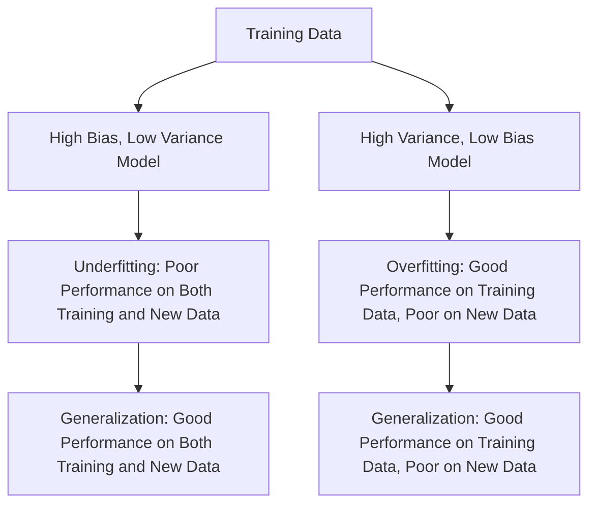

## Overfitting

### Definition
Overfitting occurs when a model is too complex and captures the noise in the training data, leading to poor generalization to unseen data. Essentially, the model becomes so specialized to the training data that it fails to perform well on new, unseen data.

### Intuition
Imagine you are trying to predict the weather based on historical data. If you use a very simple model, like just the average temperature, it might not capture all the nuances of the weather, leading to underfitting. On the other hand, if you use a highly complex model, like including every minute temperature change and weather event, it might fit the historical data perfectly but fail to predict future weather accurately. This is because the complex model is essentially memorizing the noise in the historical data, which doesn't help in predicting the future.

### Mathematical Foundation
This concept is primarily qualitative — no specific formula is needed. However, the key idea is that the difference between the in-sample error ($E_{in}$) and the out-of-sample error ($E_{out}$) should be minimized. In other words, a good model should perform similarly on both the training data and new, unseen data.

$$
E_{in} - E_{out} > \epsilon
$$

Here, $E_{in}$ is the error measured on the training data, $E_{out}$ is the error measured on new, unseen data, and $\epsilon$ is a small positive constant indicating the acceptable difference.

### Diagram

*Diagram Caption: A comparison of different models on training and new data.*

### Worked Example

**Problem:** You are working on a dataset to predict house prices based on various features such as size, location, and age. You decide to use a polynomial regression model to fit the data.

**Solution:**
1. **Data Preparation:** Load the dataset and split it into training and testing sets.
2. **Model Selection:** Start with a low-degree polynomial (e.g., degree 2) and fit the model to the training data.
3. **Evaluation:** Calculate the in-sample and out-of-sample errors for the model.
4. **Analysis:** If the in-sample error is much lower than the out-of-sample error, it indicates overfitting.
5. **Adjustment:** Increase the degree of the polynomial to improve the in-sample fit, but monitor the out-of-sample error to avoid overfitting.
6. **Validation:** Use cross-validation to ensure the model generalizes well to new data.

### Key Takeaways
- Overfitting happens when a model performs well on the training data but poorly on new, unseen data.
- High variance in the model indicates overfitting, as the model is highly sensitive to small fluctuations in the training data.
- Techniques such as cross-validation, regularization, and pruning can help manage overfitting.

### Common Misconceptions
- ⚠️ **Misconception:** Overfitting is always due to a model being too complex. **Correction:** Overfitting can also occur due to insufficient data or incorrect feature selection.
- ⚠️ **Misconception:** Overfitting can be completely avoided by increasing the model complexity indefinitely. **Correction:** Increasing model complexity indefinitely leads to diminishing returns and increased variance.