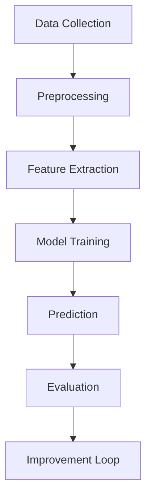

## scopeof ML

### Definition
Machine Learning is the study and application of algorithms that can learn from and make predictions on data. This core concept is essential for understanding how machines can improve their performance with experience, without being explicitly programmed.

### Intuition
Imagine you're playing a game where you have to guess the color of a ball based on its shape. At first, you might guess randomly. But as you play more, you start to notice patterns—round balls are often red, while elongated ones are blue. Over time, you get better at guessing the color. This is akin to how a machine learns. In supervised learning, the machine is given labeled examples (like being told "this round ball is red"), and it learns to predict the correct output (guessing the color correctly). In unsupervised learning, the machine has to find patterns on its own, like identifying different groups of balls without being told which is which. This process of learning from experience is the essence of Machine Learning.

### Mathematical Foundation
This concept is primarily qualitative — no specific formula is needed.

### Diagram

*Diagram Caption: A flowchart illustrating the Machine Learning process from data collection to model improvement.*

### Worked Example

**Problem:** A company wants to predict whether a customer will churn (cancel their subscription) based on their usage patterns.

**Solution:**
1. **Data Collection:** Gather data on customer usage, including the number of times they log in, the duration of their sessions, and the number of support tickets they file.
2. **Preprocessing:** Clean the data by removing outliers and handling missing values. Normalize the data to ensure that all features contribute equally to the model.
3. **Feature Extraction:** Use techniques like Principal Component Analysis (PCA) to reduce the dimensionality of the data and extract meaningful features.
4. **Model Training:** Train a logistic regression model on the preprocessed and feature-extracted data. The model learns to predict the probability of churn based on the input features.
5. **Prediction:** Use the trained model to predict the churn probability for new customers.
6. **Evaluation:** Evaluate the model's performance using metrics like accuracy, precision, and recall. Adjust the model parameters to improve its performance.
7. **Improvement Loop:** Continuously collect new data, retrain the model, and evaluate its performance to ensure it remains accurate.

### Key Takeaways
- Machine Learning involves algorithms that learn from data.
- The goal is to improve performance on a specific task through experience.
- It includes both supervised and unsupervised learning methods.
- Applications range from simple classification tasks to complex predictive models.

### Common Misconceptions
- ⚠️ **Misconception:** Machine Learning can solve any problem without human intervention. **Correction:** While Machine Learning can automate many tasks, it still requires careful design, data preparation, and ongoing monitoring.
- ⚠️ **Misconception:** All Machine Learning models are equally effective for any task. **Correction:** Different models are suited to different types of problems. Choosing the right model is crucial for achieving good performance.