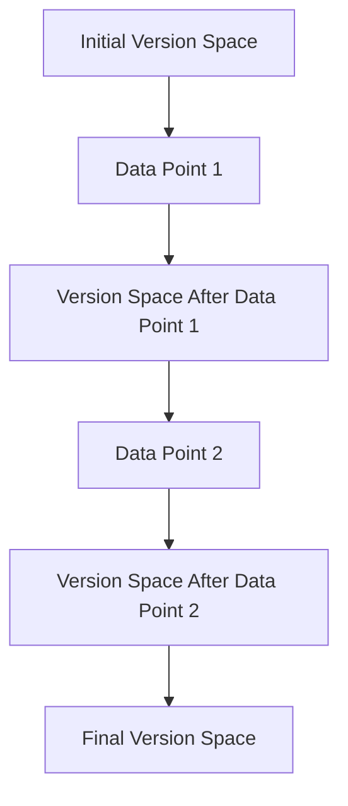

## Version Space

### Definition
Version space is a framework used in machine learning to represent the set of hypotheses that are consistent with the observed data. It is particularly useful in understanding how hypotheses evolve as more data is gathered.

### Intuition
Imagine you are trying to guess a number between 1 and 100. Initially, you might think any number could be correct. However, if you are told that the number is even, your set of possible numbers narrows down to the even numbers between 1 and 100. Now, if you are also told that the number is greater than 50, your set of possible numbers further narrows. The version space in this context would be the set of all even numbers greater than 50. Similarly, in machine learning, as we gather more data, the version space narrows down to the hypotheses that are consistent with the data.

### Mathematical Foundation
This concept is primarily qualitative — no specific formula is needed. However, we can illustrate the idea using a simple example.

### Diagram

*Diagram Caption: The process of updating the version space as new data points are observed.*

### Worked Example

**Problem:** Consider a simple classification problem where we are trying to classify points as either positive or negative based on their coordinates. We start with a set of possible hypotheses represented by linear classifiers (lines) in a 2D space.

**Solution:**
1. **Initial Version Space:** Assume we start with a set of possible lines that could separate the data. Let's say we have 5 possible lines.
2. **First Data Point:** Suppose the first data point is (1, 1) and it is classified as positive. This means any line that does not separate this point correctly is no longer in the version space. So, we remove all lines that do not pass through (1, 1) on the correct side.
3. **Second Data Point:** Suppose the second data point is (2, 2) and it is also classified as positive. Now, we remove all lines that do not separate both points correctly. This further narrows down our version space.
4. **Final Version Space:** After observing both points, the version space consists of only the lines that correctly classify both points. If we observe more points, the version space will continue to narrow down.

### Key Takeaways
- The version space represents the set of hypotheses consistent with the observed data.
- As more data is gathered, the version space narrows, leading to more specific hypotheses.
- The version space is a powerful tool for understanding the learning process.

### Common Misconceptions
- ⚠️ **Misconception:** The version space always becomes empty as more data is gathered. **Correction:** The version space can become empty only if the data points are inconsistent with each other. In most cases, the version space narrows but does not become empty.
- ⚠️ **Misconception:** The version space is only useful for classification tasks. **Correction:** The concept of version space is applicable to any type of hypothesis space, including regression and clustering tasks.